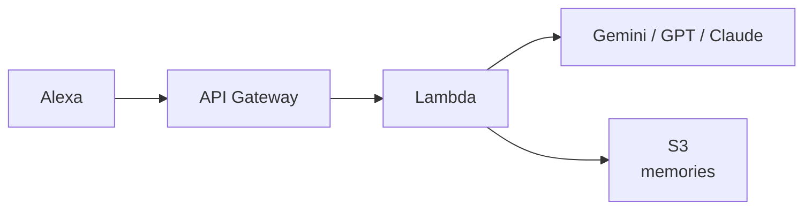

# AI Chan

Alexa 上で動作する、音声対話型の AI スキルです。  
Gemini / GPT / Claude の切り替え、Web 検索、S3 を使った会話メモリをサポートしています。

## 主な機能

- 音声コマンドでモデルを切り替え（Gemini / GPT / Claude）
- Tavily API を使った Web 検索
- 会話内容の要約を S3 に保存し、次回応答に反映
- SSML を使った読み上げ速度の調整

## アーキテクチャ



## 技術スタック

`TypeScript` `Node.js 20` `AWS SAM` `Lambda` `S3` `Vercel AI SDK` `Tavily`

## セットアップ

```bash
# 1. 依存関係をインストール
cd lambda && npm install

# 2. API キーを設定
cp .envrc.example .envrc
# .envrc を編集して各キーを入力
direnv allow

# 3. デプロイ
make deploy
```

## Alexa スキル設定

デプロイ後、[Alexa Developer Console](https://developer.amazon.com/alexa/console/ask) で設定します。

1. スキルを作成（言語: `日本語`、タイプ: `カスタム`、ホスティング: `独自のプロビジョニング`）
2. 対話モデルに `skill-package/interactionModels/custom/ja-JP.json` の内容を貼り付けて保存・ビルド
3. エンドポイントにデプロイ出力の `AlexaEndpointUrl` を設定

## 使い方

| 発話例 | 動作 |
|---|---|
| 「あいちゃんを開いて」 | 起動 |
| 「量子コンピュータについて教えて」 | AI が回答 |
| 「今日のニュースを調べて」 | Web 検索して回答 |
| 「GPTに切り替えて」 | GPT モデルに変更 |
| 「クロードを使って」 | Claude モデルに変更 |
| 「ジェミニにして」 | Gemini モデルに変更 |
| 「ストップ」 | 終了（会話を記憶に保存） |

## 環境変数

| 変数 | 用途 |
|---|---|
| `GOOGLE_GENERATIVE_AI_API_KEY` | Gemini |
| `OPENAI_API_KEY` | GPT |
| `ANTHROPIC_API_KEY` | Claude |
| `TAVILY_API_KEY` | Web 検索 |

## ディレクトリ構成

```
├── template.yaml
├── Makefile
├── .envrc
└── lambda/src/
    ├── index.ts
    ├── speech.ts
    ├── handlers/
    │   ├── LaunchRequestHandler.ts
    │   ├── AskAIIntentHandler.ts
    │   ├── CancelAndStopIntentHandler.ts
    │   └── SessionEndedRequestHandler.ts
    ├── ai/
    │   ├── registry.ts
    │   ├── generate.ts
    │   ├── prompts.ts
    │   └── tools.ts
    └── memory/
        ├── memoryService.ts
        └── summarize.ts
```

## メモリの仕組み

- セッション終了時に会話を要約して S3 の `memories.txt` に保存
- 次回起動時に保存内容をプロンプトへ注入
- 直近 10 セッションを保持し、超過分は長期記憶として統合
