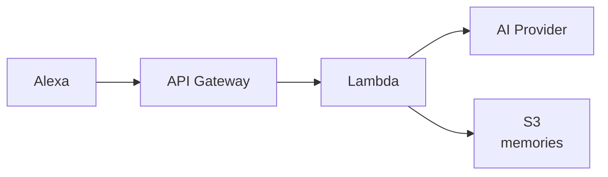
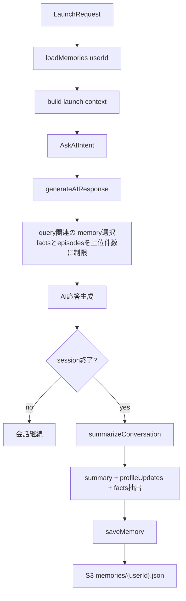

# AI Chan

Alexa 上で動作する、音声対話型の AI スキル。
Web 検索、S3 を使った会話メモリをサポート。

## 主な機能

- Vercel AI SDK によるAI応答（デプロイ時にモデル・プロバイダーを選択可能）
- Tavily API を使った Web 検索
- ユーザーごとの会話記憶を S3 に保存し、次回応答に反映
- SSML を使った読み上げ速度の調整

## アーキテクチャ



## 技術スタック

`TypeScript` `Node.js 20` `AWS SAM` `Lambda` `S3` `Vercel AI SDK` `Tavily`

## セットアップ

```bash
# 1. 依存関係をインストール
cd lambda && npm install

# 2. API キーを設定
cp .envrc.example .envrc
# .envrc を編集して各キーを入力
direnv allow

# 3. デプロイ
make deploy
```

## Alexa スキル設定

デプロイ後、[Alexa Developer Console](https://developer.amazon.com/alexa/console/ask) で設定する。

1. スキルを作成（言語: `日本語`、タイプ: `カスタム`、ホスティング: `独自のプロビジョニング`）
2. 対話モデルに `skill-package/interactionModels/custom/ja-JP.json` の内容を貼り付けて保存・ビルド
3. エンドポイントにデプロイ出力の `AlexaEndpointUrl` を設定

## 使い方

| 発話例 | 動作 |
|---|---|
| 「あいちゃんを開いて」 | 起動 |
| 「量子コンピュータについて教えて」 | AI が回答 |
| 「今日のニュースを調べて」 | Web 検索して回答 |
| 「ストップ」 | 終了（会話を記憶に保存） |

## 環境変数

| 変数 | 用途 |
|---|---|
| `AI_MODEL` | 使用するモデル（デフォルト: `google:gemini-2.5-flash`） |
| `GOOGLE_GENERATIVE_AI_API_KEY` | Google AI（Gemini 使用時） |
| `OPENAI_API_KEY` | OpenAI（GPT 使用時） |
| `ANTHROPIC_API_KEY` | Anthropic（Claude 使用時） |
| `TAVILY_API_KEY` | Web 検索 |
| `MEMORY_PROMPT_MAX_FACTS` | プロンプトに注入する記憶 fact 件数上限（デフォルト: `4`） |
| `MEMORY_PROMPT_MAX_EPISODES` | プロンプトに注入する episode 件数上限（デフォルト: `1`） |
| `MEMORY_PROMPT_MAX_CHARS` | 注入メモリ全体の文字数上限（デフォルト: `1000`） |

## ディレクトリ構成

```
├── template.yaml
├── Makefile
├── .envrc
└── lambda/src/
    ├── index.ts
    ├── speech.ts
    ├── handlers/
    │   ├── LaunchRequestHandler.ts
    │   ├── AskAIIntentHandler.ts
    │   ├── CancelAndStopIntentHandler.ts
    │   └── SessionEndedRequestHandler.ts
    ├── ai/
    │   ├── registry.ts
    │   ├── generate.ts
    │   ├── prompts.ts
    │   └── tools.ts
    ├── memory/
    │   ├── memoryService.ts
    │   └── summarize.ts
    └── util/
        └── getUserId.ts
```

## メモリの仕組み

現在は、ユーザーごとに構造化メモリを S3 の `memories/{userId}.json` へ保存する。

### 保存データ

- `profile`: ユーザープロファイル（名前、呼び名、好みなどの key-value）
- `facts`: 将来の会話で再利用しやすい事実（カテゴリ・本文・確信度・時刻）
- `episodes`: セッション単位の要約履歴
- `revision`: 更新世代（同時更新の検知に利用）

### フロー（起動〜会話〜保存）



### 速度最適化（音声UX優先）

- 会話中に注入する記憶は「関連度の高い上位のみ」に制限
- 注入件数・文字数は環境変数で調整可能
  - `MEMORY_PROMPT_MAX_FACTS`
  - `MEMORY_PROMPT_MAX_EPISODES`
  - `MEMORY_PROMPT_MAX_CHARS`
- セッション中に重い統合処理を走らせず、保存系は終了時に集約

### データ品質・安全性

- `facts` は「1レコード1事実」で保存し、重複はマージ
- 機微情報（認証/金融/健康/詳細住所など）は保存対象から除外
- ユーザー識別は `personId > userId > _shared` の優先順

### メモリJSONイメージ

```json
{
  "version": 2,
  "revision": 12,
  "updatedAt": "2026-02-15T12:34:56.000Z",
  "profile": {
    "呼び名": "りょー"
  },
  "facts": [
    {
      "id": "abc123",
      "category": "preference",
      "content": "辛い料理が好き",
      "confidence": 0.92,
      "timestamp": "2026-02-15 21:30",
      "source": "session"
    }
  ],
  "episodes": [
    {
      "timestamp": "2026-02-15 21:30",
      "summary": "夕飯の相談をして、辛い料理の話題で盛り上がった。"
    }
  ]
}
```
